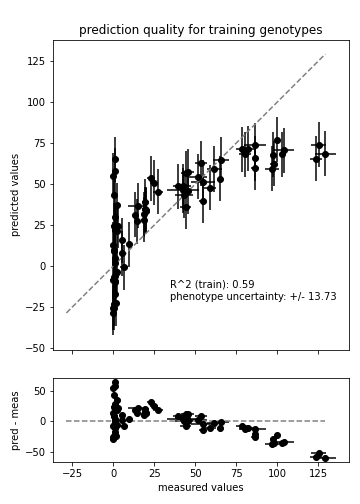
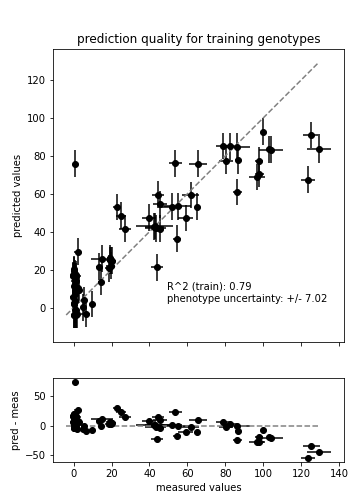
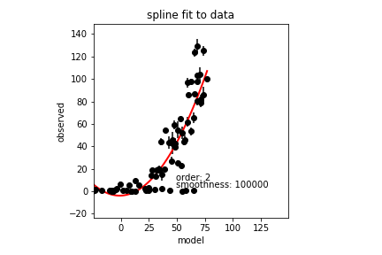
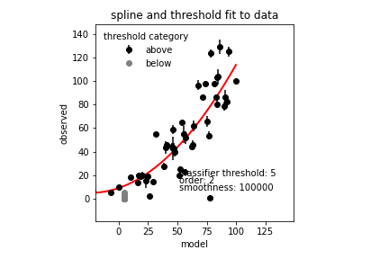
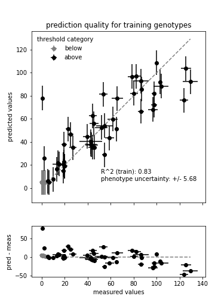
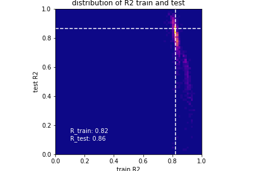
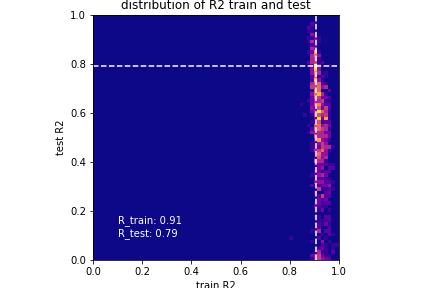
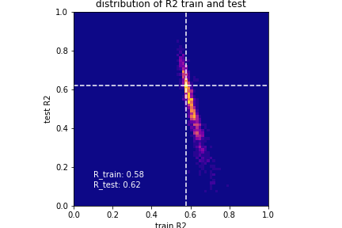
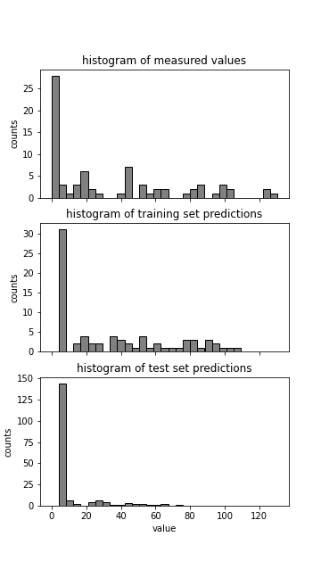

Tutorial
========

Predicting phentoypes with a maximum likelihood model
-----------------------------------------------------

We're going to fill in unmeasured phenotypes for the genotype-phenotype map of a protein that
transports a small molecule.  It is binary map with eight sites, so it has
:math:`2^{8}=256` genotypes.  Of these, we have experimental measurements of
the transport phenotype for 76 genotypes.

If you haven't already, you can download the data file containing the measurements,
``pfcrt-raw-data.csv``, by running:

.. code-block::

    > gpseer fetch-example

    [GPSeer] Downloading files to /examples...
    [GPSeer] └──>: 100%|██████████████████| 3/3 [00:00<00:00,  9.16it/s]
    [GPSeer] └──> Done!

    cd examples/

We'll start by fitting an additive model to the data. In this model, each
mutation has an additive, linear effect on the phenotype. We
predict the phenotype of each genotype as the sum of the effect of all
mutations that are found in that genotype.  The additive model is the default
model, so we you can run the following:

.. code-block::

    > gpseer estimate-ml pfcrt-raw-data.csv

    [GPSeer] Reading data from pfcrt-raw-data.csv...
    [GPSeer] └──> Done reading data.
    [GPSeer] Constructing a model...
    [GPSeer] └──> Done constructing model.
    [GPSeer] Fitting data...
    [GPSeer] └──> Done fitting data.
    [GPSeer] Predicting missing data...
    [GPSeer] └──> Done predicting.
    [GPSeer] Calculating fit statistics...
    [GPSeer]

    Fit statistics:
    ---------------

                  parameter     value
    0         num_genotypes        76
    1  num_unique_mutations         8
    2   explained_variation  0.594918
    3   num_obs_to_converge   35.5691
    4             threshold      None
    5          spline_order      None
    6     spline_smoothness      None
    7       epistasis_order         1

    [GPSeer]

    Convergence:
    ------------

      mutation  num_obs  fold_target  converged
    0      I0M       47     1.321372       True
    1      N1E       46     1.293257       True
    2      T2K       12     0.337371      False
    3      A3S       41     1.152686       True
    4      E4Q       35     0.984000      False
    5      S5N       46     1.293257       True
    6      I6T       28     0.787200      False
    7      R7I       30     0.843429      False

    [GPSeer] └──> Done.
    [GPSeer] Writing phenotypes to pfcrt-raw-data_predictions.csv...
    [GPSeer] └──> Done writing predictions!
    [GPSeer] Writing plots...
    [GPSeer] Writing pfcrt-raw-data_correlation-plot.pdf...
    [GPSeer] Writing pfcrt-raw-data_phenotype-histograms.pdf...
    [GPSeer] └──> Done plotting!
    [GPSeer] GPSeer finished!

You should have seen output like what is shown above, indicating the program ran.  We'll
worry about all of the output later, but for the moment, we'll start by asking
if the fit yielded anything useful.  The first place we might look is the
``explained_variation`` field under the ``Fit statistics`` heading in the text output.
For this model, we get
0.595.  If the model was perfect, we could get a value of 1.000, so 0.595 is not
stellar.  The next place we can look is at the correlation plot generated:
``pfcrt-raw-data_correlation-plot.pdf``:

This plot shows the predicted value for each genotype in the training set
against its predicted value. For a good model, we would expect our predictions
to fall along the 1:1 line.  This would appear as randomly distributed
residuals on the bottom plot.  What we see instead is some pretty dramatic
non-randomness: for lower phenotype values, the model predicts most phenotypes
as too high; for higher values, the model predicts phenotypes that are
too low.

We can account for this nonlinearity using a `spline <https://docs.scipy.org/doc/scipy/reference/tutorial/interpolate.html>`_,
which will draw a curve through the points and then linearize the data.
If we pre-process our data with this spline first, our linear model may be more
predictive. So, let's add a spline.  We'll set the order to 2, which lets us
introduce a single curve in the data.  For more complicated curves, we could
increase the order to up to 5.

I'm also going to add an ``output_root`` argument ("linear_spline2") so our new
predictions won't overwrite our existing predictions. This root will be
pre-pended to every output file.

.. code-block::

    > gpseer estimate-ml pfcrt-raw-data.csv --spline_order 2 --output_root linear_spline2

    ...

    RuntimeError:

    spline fit failed.  Try increasing --spline_smoothness

I removed a bunch of the output text above and just included the final line: an
error.  This indicates that our spline fit did  not converge.  The way to fix
this is by increasing the spline smoothness. (We are increasing ``s`` in the
underlying `scipy.interpolate.UniverateSpline <https://docs.scipy.org/doc/scipy/reference/generated/scipy.interpolate.UnivariateSpline.html>`_
object).

I increased the value of ``--spline_smoothness`` until it worked:

.. code-block::

    > gpseer estimate-ml pfcrt-raw-data.csv --spline_order 2 --spline_smoothness 100000  --output_root linear_spline2

    ...

    2   explained_variation  0.792999

    ...

Great, that worked!  Again, I've removed most of the output and highlighted an
important bit: the explained variation has gone up, from ``0.595`` in our initial
fit to ``0.793``.  Good news!  We can also look at the output plot ``linear_spline2_correlation-plot.pdf``:

This looks much better than the plot above.  We're explaining more of the variation,
and our residuals are a bit more random.  There is still something strange happening,
particularly at low phenotypes, but this is a definite improvement.

We can see what the spline looks like by checking out ``linear_spline2_spline-fit.pdf``:

This plot shows the observed value for each genotype against its prediction
using the linear model.  The spline goes through the nonlinearity, capturing the
fact there is a lag between the phenotype as modeled and the phenotype as
observed.

But there is still something odd.  Notice the systematic string of points that
are close to zero in our observations but are predicted to be much larger than
zero by the model.  One way to get this behavior is by having a detection
threshold on our assay.  I happen to know from the group that generated this data
that their assay bottoms out at 5.  This means a negative control can give a
value anywhere from 0 to 5 under their assay conditions.  But our model doesn't
know this and will dutifully record that a phenotype of 3 is higher than a
phenotype of 1, which is less than a phenotype of 5.  The model tries to explain
these differences due to differences in the sequences of the genotypes.  As
a result, we inject random noise into our fit and screw up our predictions of
these points that are below the detection threshold.

To account for this, we can train a logistic classifier.  This classifier
predicts whether a genotype is below or above the detection threshold.  Anything
predicted to be below the threshold is removed from the analysis before the
spline and linear model are fit to the data.  To add the classifier, we put in
our detection threshold (``--threshold 5``).  Note I also updated the
``output_root`` argument to be "linear_spline2_threshold5":

.. code-block::

    gpseer estimate-ml pfcrt-raw-data.csv --spline_order 2 --spline_smoothness 100000  --threshold 5 --output_root linear_spline2_threshold5

    ...

    2   explained_variation  0.832367

    ...

This gave a slight increase in our explained variance (``0.832`` rather than
``0.793``).  We can look first at the spline plot in ``linear_spline2_threshold5_spline-fit.pdf``:

Notice that almost all of those strange points have no collapsed down to zero:
our classifier has identified all of the gray points as being below the detection
threshold.  How lets look at the correlation plot in ``linear_spline2_threshold5_correlation-plot.pdf``:

The model is looking much better.  A whole slew of poor predictions at lower
phenotype values are now correctly predicted.  Except for the highest phenotype values, the
residuals appear random.  Conceivably, one could increase the order of the
spline to to better fit the data; however, this is unsuccessful for this
dataset.  If you don't believe me, you can run the above analysis with a
higher-ordered spline.  (It might be a good exercise, anyway).

Testing Predictive Power: Cross-Validation
------------------------------------------

The analysis above identified a model that fit the measured data well: how do
we know it has good predictive power?  GPSeer lets you pose this question
using cross validation.  In cross validation, a subset of the training data are
withheld.  The model is then trained on the remaining training data.  The
predictive power of the model can then be tested on the withheld data.  By
repeating this process multiple times, one can measure the predictive power
of the model.

We call this similarly to the estimate above, but substitute the ``cross-validate``
subcommand rather than ``estimate-ml``.  I also increased the number of samples
(``--n_samples 1000``) to get a pretty graph.  This took about 2 minutes on my
laptop.

.. code-block::

    > gpseer cross-validate pfcrt-raw-data.csv --spline_order 3 --spline_smoothness 100000 --threshold 5 --output_root linear_spline2_threshold5 --n_samples 1000

    [GPSeer] Reading data from pfcrt-raw-data.csv...
    [GPSeer] └──> Done reading data.
    [GPSeer] Fitting all data data...
    [GPSeer] └──> Done fitting data.
    [GPSeer] Sampling the data...
    [GPSeer] └──>: 100%|████████████████████| 1000/1000 [01:47<00:00,  9.33it/s]
    [GPSeer] └──> Done sampling data.
    [GPSeer] Plotting linear_spline2_threshold5_cross-validation-plot.pdf...
    [GPSeer] └──> Done writing data.
    [GPSeer] Writing scores to linear_spline2_threshold5_cross-validation-scores.csv...
    [GPSeer] └──> Done writing data.
    [GPSeer] GPSeer finished!

The primary output of this analysis is the graph stored in
``linear_spline2_threshold5_cross-validation-plot.pdf``:

This plot is a two-dimensional histogram plotting :math:`R^{2}_{train}` against
:math:`R^{2}_{test}`. Each sample is a different randomly selected test and
training set.  Bright colors indicate populated regions of the histogram. The
majority of the fits form a cloud with similar values for :math:`R^{2}_{train}`
and :math:`R^{2}_{test}`.  The dashed white lines indicate the most populated
bin in both dimensions.  The numbers indicate the values of :math:`R^{2}_{train}`
and :math:`R^{2}_{test}` for this bin.

Notice that, for this fit, :math:`R^{2}_{train}` and :math:`R^{2}_{test}` have
similar values near 0.85.  This is a good indication that the model is
predictive at the same level it is trained: the model is highly trained, but not
overtrained.

We can contrast this with a model that is overfit.  We will add pairwise interaction
terms (epistasis) between the effects of mutations to our training model.  To do
so, I added ``--epistasis_order 2`` and changed ``--output_root`` to
``pairwise_spline2_threshold5``.

.. code-block::

    > gpseer cross-validate pfcrt-raw-data.csv --spline_order 3 --spline_smoothness 100000 --threshold 5 --epistasis_order 2 --output_root pairwise_spline2_threshold5 --n_samples 1000

    ...

The cross-validation plot that results is here:

Notice that the distribution in :math:`R^{2}_{test}` is now much wider, and is
splayed between 0 and 1.  More alarmingly, :math:`R^{2}_{train}` and :math:`R^{2}_{test}`
have begun to diverge.  The most common outcome of the sampling protocol is a
model with  :math:`R^{2}_{train} = 0.91` and :math:`R^{2}_{test} = 0.79`.
We are improving our ability to fit the training
data at the expense of our ability to predict the test data.

We can make things even worse by fitting three-way interactions (high-order)
epistasis.

.. code-block::

    > gpseer cross-validate pfcrt-raw-data.csv --spline_order 3 --spline_smoothness 100000 --threshold 5 --epistasis_order 3 --output_root three-way_spline2_threshold5 --n_samples 1000

    ...

The resulting plot is shown below:

.. image::  tutorial_3_2nd_threshold5_correlation_cross-validation-plot.png
    :align: center

Note the even greater divergence between :math:`R^{2}_{train} = 0.98` and
:math:`R^{2}_{test} = 0.26`.

Finally, for comparison, we can compare the cross-validation result for over fitting
a model to the cross-validation result for under fitting a model. We can do a
cross-validation run for the first model we fit above: the linear model alone
without the spline or classifier.

.. code::

    gpseer cross-validate pfcrt-raw-data.csv  --output_root linear_spline2_threshold5 --n_samples 1000

    ...

Note that, for this model, :math:`R^{2}_{test}` and :math:`R^{2}_{train}` are
lower than for the best model, but have also moved together.  Both values are
near 0.6.  Thus, this is a poor fit, but not an over fit.

Thus, a cross-validation plot provides a useful way to identify a predictive
model for phenotypes.  In this case, the best model is a threshold, nonlinear
spline, and additive mutation model.

Uncertainty
-----------

Another important question from these predictions is the uncertainty on the
model predictions.  Uncertainty is returned for each phenotype in the
``_predictions.csv`` output file (``linear_spline2_threshold5_predictions.csv``
for the best-fit model).  The uncertainty on predicted phenotypes above the
threshold is given by :math:`(1 - R^{2}_{test}) \times \langle phenotype \rangle`.
This is described in the GPSeer publication.

Convergence
-----------

One question is whether it is worthwhile to make more measurements to improve
the predictive power of the model. GPSeer provides information to help make
this decision. After a fit, it returns a file that ends with ``_convergence.csv``
as well as a file that ends with ``_fit-information.csv``
(``linear_spline2_threshold5_convergence.csv`` and
``linear_spline2_threshold5_fit-information.csv`` for the best-fit model).

For an additive model, the more times we observe each mutation, the better we
are at resolving its average effect.  After a sufficient number of observations,
these average effects are resolved and we can no longer improve the model further.
The number of times we need to see a mutation before our estimate of its effect
converges is determined by the scatter off the 1:1 line in the correlation plot.
The more scatter, the more observations we need to make.

We found an empirical relationship that allows us to estimate the number of
observations we need to make given the amount of unexplained variation in the
model (Figure 5 in the GPSeer manuscript). This number is spit out as
``num_obs_to_converge`` in the ``_fit-information`` file, as well as the text
spew during a run.  For the best model above, this value is 18.0--meaning we
need to observe each mutation 18 times to resolve is average effect.

The content of ``linear_spline2_threshold5_convergence.csv`` is shown below.  It
indicates the mutations seen in the dataset (the "mutation" column), the number of
measured genotypes in which that mutation was seen ("num_obs"), and the number
of genotypes above the threshold cutoff in which that mutation was seen
("num_obs_above"). Genotypes below the cutoff threshold are not used to train
the linear model, and thus do not contribute to the number of observations. The
"fold_target" column shows the ratio of ``num_obs_above`` to
``num_obs_to_converge``.  If this value is above 1, adding more observations
with that particular genotype probably will not improve the predictive power
of the model.

+---+----------+---------+--------------+-------------+-----------+
|   | mutation | num_obs |num_obs_above | fold_target | converged |
+===+==========+=========+==============+=============+===========+
| 0 | I0M      | 47      | 26           | 1.44        | True      |
+---+----------+---------+--------------+-------------+-----------+
| 1 | N1E      | 46      | 40           | 2.22        | True      |
+---+----------+---------+--------------+-------------+-----------+
| 2 | T2K      | 12      | 0            | 0.00        | False     |
+---+----------+---------+--------------+-------------+-----------+
| 3 | A3S      | 41      | 28           | 1.55        | True      |
+---+----------+---------+--------------+-------------+-----------+
| 4 | E4Q      | 35      | 18           | 1.00        | True      |
+---+----------+---------+--------------+-------------+-----------+
| 5 | S5N      | 46      | 24           | 1.33        | True      |
+---+----------+---------+--------------+-------------+-----------+
| 6 | I6T      | 28      | 19           | 1.05        | True      |
+---+----------+---------+--------------+-------------+-----------+
| 7 | R7I      | 30      | 21           | 1.16        | True      |
+---+----------+---------+--------------+-------------+-----------+

If we look at this table, we saw seven of the eight mutations 18+ times,
consistent with convergence.  One mutation--T2K--was *never* observed above the
threshold.  This mutation does not contribute to the linear model and can
therefore be ignored.  Overall, then, this is good evidence that the predictive
model has converged.

Phenotype histograms
--------------------

Another way to assess the quality of the predictive model is to compare a
histogram of the phenotype values for the training set to the predicted
phenotypes.  The output for this is stored in
``linear_spline2_threshold5_phenotype-histograms.pdf`` and reproduced below:

The top panel shows the histogram for the measured values.
The middle panel shows the histogram for the model *predictions* of the
training (measured) values.  The bottom panel shows the distribution of the
values predicted for the unmeasured values.  A radical mismatch between the
distribution of the values in the training set and the predictions may indicate
a mismatch between the genotypes used to train the model and the genotypes that
are being predicted.
